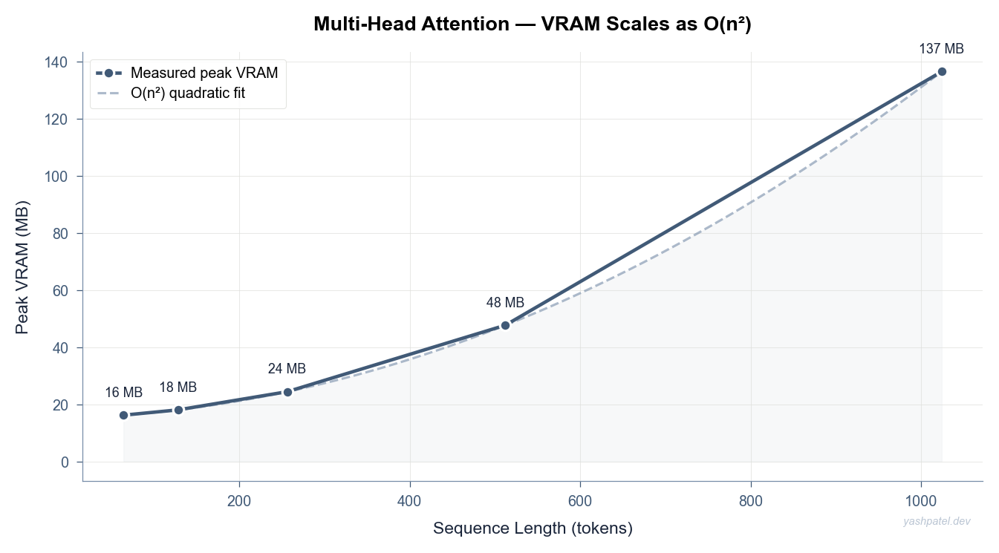
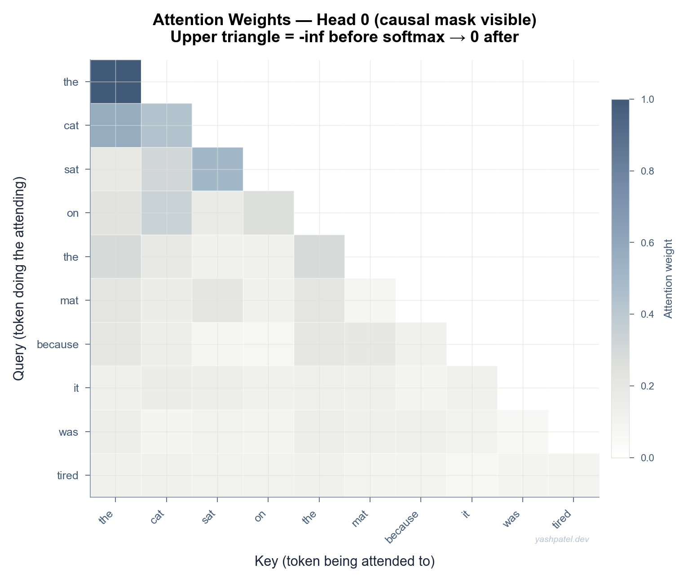
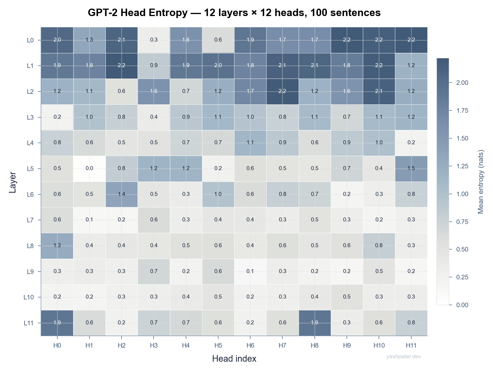
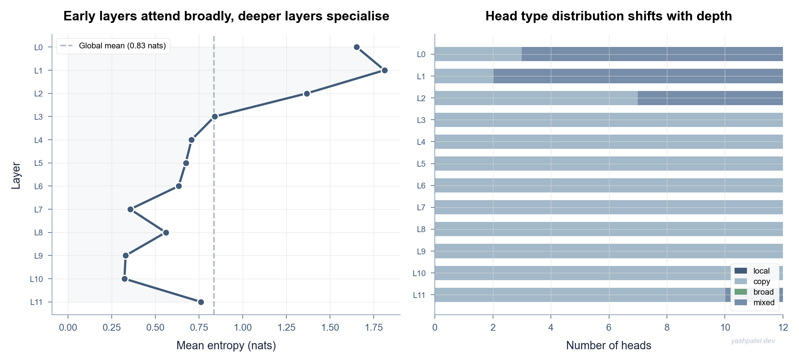
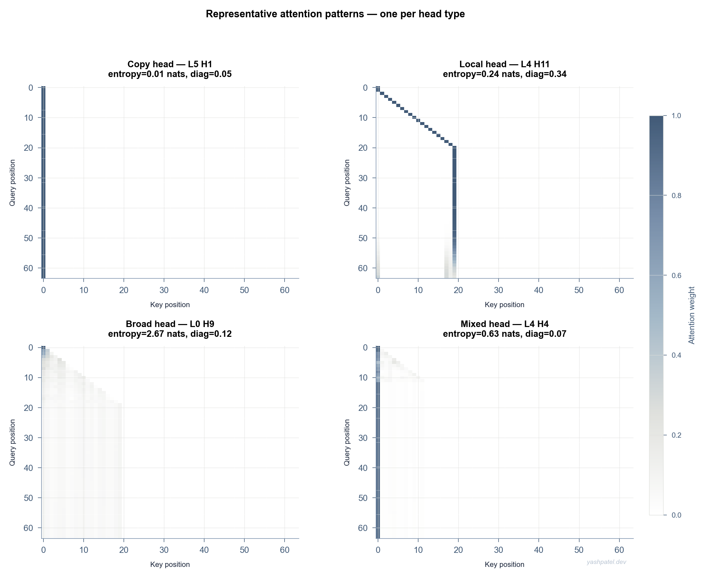

# Attention Is All You Need — Code + Analysis Artifacts

This repository contains two focused Python artifacts around transformer attention:

1. **`attention_from_scratch.py`** — a from-scratch PyTorch implementation of scaled dot-product and multi-head attention, including verification against `torch.nn.functional.scaled_dot_product_attention`.
2. **`attention_head_analysis.py`** — a reproducible GPT-2 small head analysis pipeline that computes entropy/locality metrics and classifies all 144 heads (12 layers × 12 heads) across a 100-sentence corpus.

It accompanies the blog post: **[Attention Is All You Need: Early Layers Diffuse, Late Layers Precise, the Head Entropy Gradient the Paper Never Measured](https://yashpatel.xyz/blog/attention-is-all-you-need-what-the-paper-s-heads-are-actually-doing-at-each-layer)**.

## Why this repo exists

The repo turns the blog’s claims into runnable code and concrete outputs:

- **Mechanics**: implement attention step-by-step, with causal masking and multi-head projections.
- **Correctness**: numerically compare the manual implementation to PyTorch’s reference SDPA.
- **Scaling behavior**: measure and visualize the expected **O(n²)** VRAM growth with sequence length.
- **Head behavior by depth**: quantify how GPT-2 head attention changes from early to late layers using entropy and diagonal-locality metrics.

## Repository files

| File | Purpose | Main outputs |
|------|---------|--------------|
| `attention_from_scratch.py` | End-to-end attention implementation + verification + VRAM experiment | `attention_vram_quadratic.png`, `attention_heatmap.png` |
| `attention_head_analysis.py` | GPT-2 small attention extraction, per-head metrics, type classification, plots | `head_entropy_heatmap.png`, `head_layer_depth_gradient.png`, `head_type_examples.png` |
| `requirements.txt` | Pinned runtime dependencies (`torch`, `matplotlib`, `numpy`, `transformers`) | — |

## Setup

```bash
pip install -r requirements.txt
# Optional GPU wheel:
pip install torch==2.1.0 --index-url https://download.pytorch.org/whl/cu121
```

## Run

```bash
python attention_from_scratch.py   # ~2 minutes
python attention_head_analysis.py  # ~5 minutes
```

## Hardware notes

Developed on RTX 3090 (24GB VRAM), but both scripts can run on CPU.

- `attention_from_scratch.py`: typically under 1GB VRAM up to seq_len=1024
- `attention_head_analysis.py`: GPT-2 small analysis around ~600MB VRAM

## Visual outputs (generated by this repo)

### 1) Attention implementation + scaling (`attention_from_scratch.py`)

**Peak VRAM vs sequence length (quadratic trend):**



**Sample head attention map from the concrete sentence pass:**



### 2) GPT-2 head analysis (`attention_head_analysis.py`)

**12×12 entropy map (layer × head):**



**Layer-depth entropy gradient + head-type composition:**



**Representative matrices for classified head types (copy/local/broad/mixed):**



## Blog-aligned highlights grounded in this codebase

- The scripts operationalize the blog’s main thesis that **head behavior shifts with depth**.
- `attention_head_analysis.py` computes entropy directly from attention matrices and reports a clear early-vs-late separation:
  - Early layers (0–3): ~**1.421 nats**
  - Late layers (8–11): ~**0.497 nats**
  - Gradient (late − early): **−0.924 nats**
- The same pipeline also classifies each head by entropy and diagonal locality, enabling structured categories (`copy`, `local`, `broad`, `mixed`) that can be inspected visually.
- `attention_from_scratch.py` complements this by validating core attention math and showing the quadratic memory pressure that motivates optimized attention kernels.

## Key finding

Shannon entropy decreases with depth in GPT-2 small, with late-layer heads substantially sharper than early-layer heads.

```text
KEY FINDING: layer-depth entropy gradient
  Early layers (0-3)  mean entropy : 1.421 nats
  Late  layers (8-11) mean entropy : 0.497 nats
  Gradient            (late-early) : -0.924 nats
```
